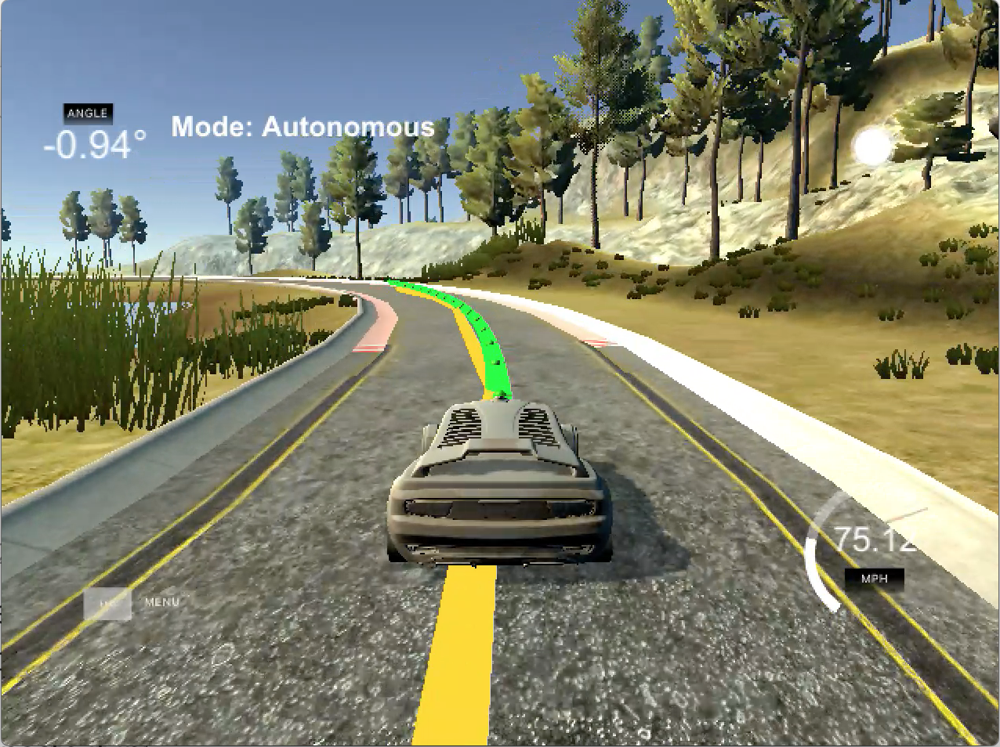
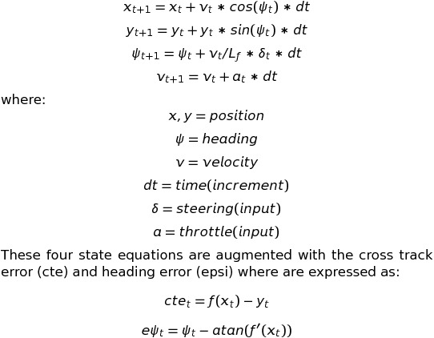

# Model Predictive Control (MPC) Project

## Objective
The objective is to use model predictive control to successfully navigate a simulated car around a track.  The simulator provides the user with the current position, heading, velocity of the car.  In addition, the simulator provides a list of waypoints that represent the track center line from the current car position forward. The objective is to use the data provided by the simulator along with a state model of the car kinematics and predict the steering and throttle values that will cause the car to successfully navigate the track as illustrated in the video below.

## Implementation
The classic "bicycle model" was used to describe car the kinematics in state space.  Hence the state model used for the MPC was given as:

and y=f(x) is the desired path of the car.

The Implementation of the MPC is as follows:
1. Obtain the current car position (x,y) and waypoints from the simulator.
2. It is assumed that there will be a 100ms latency between receiving the simulator data and sending the steering and throttle commands back to the simulator.  Therefore, the car state is advanced by 100ms according to the first four state equations.  It should be noted that the simulator velocity is given in MPH while the simulator x and y positions are in meters.  Hence the velocity must be converted to meters per second before applying it to the state equations.
3. A coordinate transformation is then applied to the waypoints to put the waypoints into the car coordinate system.  That is, the new coordinates have x aligned with the cars longitudinal axis and (x,y) = (0,0) located at the nose of the car.
4. The transformed waypoints are then fit to a polynomial of order N=2.  Any higher order fitting was unnecessary given the short distance the waypoints traversed.
5. The curve fit was defined as the desired path (y=f(x)), hence the last two states (cte and epsi) could be calculated per the equations above.
6. This established the state of the car after the latency period (in car coordinates) as 0, 0, 0, v, cte and epsi.  This state was then feed into the MPC Solve module which returned the steering and throttle actuation values.

The MPC class set up the model constraints and how far into the future to predict the car path.  The steering was limited to +/-25degrees, hence the steering was constrained to be within [-0.436332, 0.436332] (radians).  The throttle was limited to [-1, 1]. As to the prediction time step and number of predictions, the values I finally choose were 0.05sec and 18 steps.  These seemed to insure that the predicted path was about equal to the path of the waypoints.  Decreasing the number of time increments while holding the time step constant resulted in erratic steering behavior (including leaving the track).  Increasing the time step (while proportionally reducing the number of time increments) also resulted in erratic steering behavior particularly at higher speeds.

The MPC cost function was defined by calling the class FG.  The cost was broken down into several components.
